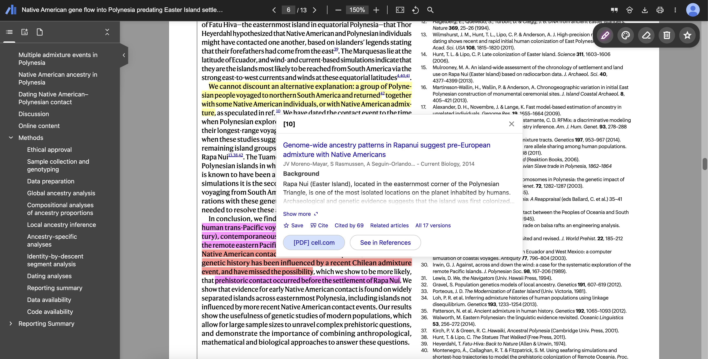

# Scholar PDF Reader with Annotations

This extension adds annotation capabilities to the Google Scholar PDF Reader extension. The extended features include:

- Highlight text with colors (yellow, green, blue, pink, red, or custom).
- Easily remove individual annotations or clear them all at once.
- Undo and redo actions for annotations.
- Import and export annotations into a JSON file.

Currently, annotations are stored in the browser's local storage and associated with each document URL. The PDF files are not modified, but annotations persist across browser sessions.

The extension maintains all the functionality of the original Google Scholar PDF Reader:

- Preview references as you read. Click the in-text citation to see a summary and find the PDF.
- Read faster with the AI outline. Get a quick overview and click on interesting bullets to jump within the paper.
- Click in-text figure mentions to see the figure and the back button to keep reading.
- Make it right for your eyes with light, dark, and night modes.
- Copy and paste common citation formats without leaving the paper.
- Save articles to your Scholar Library to read or cite later.

The annotation functionality is implemented through separate modules without modifying the original extension's code.

## Installation

The extension works with all Chromium-based browsers, including Google Chrome, Microsoft Edge, and Brave.
Unfortunately, the original extension uses features unsupported by Firefox or Safari, so it cannot be installed on those browsers.

To install the extension, follow these steps:

0. Uninstall the original Google Scholar PDF Reader extension if you have it installed.
1. [Download the latest release](https://github.com/salcc/Scholar-PDF-Reader-with-Annotations/releases/latest).
2. Extract the ZIP file to a folder on your computer.
3. Open the browser's extension management page:
   - Chrome: `chrome://extensions`
   - Edge: `edge://extensions`
   - Brave: `brave://extensions`
   - Other: check the browser's documentation for the extension management page.
4. Enable developer mode if it is not already enabled (usually a toggle switch in the top right corner).
5. Click "Load unpacked" and select the "extension" folder inside the extracted ZIP file.

The extension should now be installed and ready to use!

Note that the extension will not automatically update when new versions are released. To update the extension, download the latest release and repeat the installation steps. You can watch the GitHub repository to receive notifications of new releases.

> [!CAUTION]
> Annotations may be lost when updating or reloading the extension. Export them in settings beforehand, then import them afterward to prevent data loss.

## Usage

The annotation capabilities are easily accessible through the annotation toolbar. Moreover, these keyboard shortcuts can be used:

- <kbd>h</kbd>: Toggle the highlight tool.
- <kbd>d</kbd>: Toggle the draw tool.
- <kbd>t</kbd>: Toggle the text tool.
- <kbd>c</kbd>: Change to the next color of the active tool.
- <kbd>e</kbd>: Toggle the erase tool.
- <kbd>Esc</kbd>: Deactivate the active tool.
- <kbd>Ctrl</kbd>/<kbd>Cmd</kbd> + <kbd>z</kbd>: Undo the last action.
- <kbd>Ctrl</kbd>/<kbd>Cmd</kbd> + <kbd>y</kbd> or <kbd>Ctrl</kbd>/<kbd>Cmd</kbd> + <kbd>Shift</kbd> + <kbd>z</kbd>: Redo the last undone action.

## Planned Features

The following features are planned for future releases:

- Storage backup in the cloud (Google Drive and iCloud probably).
- Underline and strikeout text.
- Drawing tools (freehand, lines, shapes).
- Text comments and sticky notes.
- Movable and minimizable annotation bar.
- Add more functionalities to the settings page, such as annotation transfer between PDF files and selective removal or keyboard shortcut customization.

## Implementation Questions

Q: Why there is no support for Firefox or Safari?\
A: The original extension uses the sandbox key in the manifest.json file, which is only supported by Chromium-based browsers. Firefox and Safari do not support this key, so the extension cannot be installed on those browsers. [[MDN](https://developer.mozilla.org/en-US/docs/Mozilla/Add-ons/WebExtensions/manifest.json/content_security_policy#browser_compatibility)]

Q: Why is the code of the original extension included in this one? Why not just make an extension that works with the original one?\
A: Browser extensions are sandboxed and cannot directly interact with each other.

Q: Why are annotations stored in the browser's local storage instead of modifying the PDF files?\
A: Extensions cannot directly modify files on the user's computer, so an external program would possibly be needed to modify the PDF files. This is a complex feature that is not planned for the near future.

If you find workarounds to these limitations, contributions are welcome!

## Support & Contributions

For bug reports and feature suggestions, please open an issue on GitHub. Feel free to also submit pull requests that enhance the extension.

## Disclaimer

This project is not affiliated with, supported, or endorsed by Google.
